# 🔸 graph

Command to visualize worktree dependencies and branch relationships in various formats. Provides insights into branch hierarchy, commit relationships, and worktree health through interactive graphs and diagrams.

## Overview

```bash
mst graph [options]
mst g [options]  # alias
```

## Usage Examples

### Basic Usage

```bash
# Display Mermaid diagram (default)
mst graph

# Generate Graphviz DOT format
mst graph --format dot

# Save to file
mst graph --output dependencies.md
```

### Advanced Usage

```bash
# Detailed view with commit information
mst graph --show-commits --show-dates

# Generate PNG image (requires Graphviz)
mst graph --format dot --output deps.dot
# Automatically generates deps.png if Graphviz is installed

# Complex analysis with depth limit
mst graph --format mermaid --depth 5 --show-dates --output branch-tree.md
```

## Options

| Option | Short | Description | Default |
|--------|-------|-------------|---------|
| `--format <type>` | `-f` | Output format (mermaid, dot) | `mermaid` |
| `--output <file>` | `-o` | Save to file instead of stdout | stdout |
| `--show-commits` | | Display latest commit information | `false` |
| `--show-dates` | | Show last update dates | `false` |
| `--depth <number>` | `-d` | Maximum hierarchy depth to display | `3` |

## Output Formats

### Mermaid Format (Default)

Generates Mermaid.js compatible diagrams for documentation:

```bash
mst graph --format mermaid
```

**Output:**

```mermaid
graph TD
  main[main]
  feature_authentication[feature/authentication<br/>↑3 ↓0]
  main --> feature_authentication
```


### Graphviz DOT Format

Professional graph visualization with automatic image generation:

```bash
mst graph --format dot --output dependencies.dot
```

**Automatic PNG generation:**
```bash
# If Graphviz is installed, automatically generates dependencies.png
brew install graphviz
mst graph --format dot --output deps.dot
# → Creates both deps.dot and deps.png
```

## Branch Relationship Analysis

The graph command analyzes several aspects of branch relationships:

- **Parent Branch Discovery**: Uses `git merge-base` to find common ancestors
- **Commit Analysis**: Shows divergence from parent branches  
- **Age calculation**: Determines days since last update
- **Health Assessment**: Identifies branches with no activity for 30+ days

## Use Cases

### Development Planning

```bash
# Before starting new feature
mst graph --show-dates
# → Identify which branches to base new work on
```

### Code Review Process

```bash
# During PR review
mst graph --format mermaid --show-commits
# → Understand branch context
```

### Repository Cleanup

```bash
# Maintenance tasks
mst graph --show-dates
# → Find stale branches for cleanup
```

## Troubleshooting

### Common Issues

1. **Graphviz image generation fails**
   ```bash
   # Install Graphviz
   brew install graphviz  # macOS
   sudo apt-get install graphviz  # Ubuntu
   ```

2. **Slow performance with many worktrees**
   ```bash
   # Use depth limiting
   mst graph --depth 2
   ```

## Related Commands

- [`mst list`](./list.md) - List all worktrees (data source for graph)
- [`mst dashboard`](./dashboard.md) - Visual web interface with similar information
- [`mst health`](./health.md) - Detailed health analysis of individual worktrees